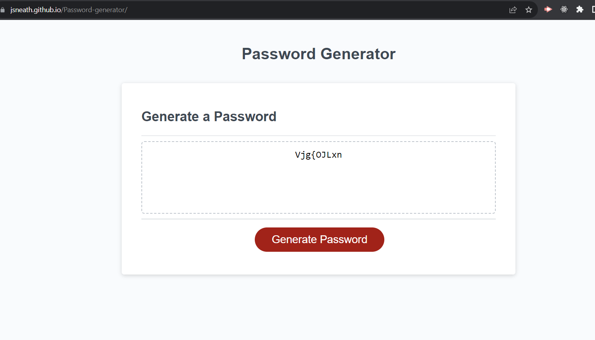

# Password-generator

Welcome to the Password Generator project! This application allows users to create strong and secure passwords ranging from 8 to 128 characters based on their specific criteria.

## Features

- **Flexible Length**: Users can specify the desired password length, ranging from 8 to 128 characters.
- **Character Types**: Users have the flexibility to choose from:
  - Lowercase letters
  - Uppercase letters
  - Numeric values
  - Special characters (e.g., `@`, `#`, `$`, etc.)
- **User-Friendly Interface**: Through a series of prompts, users can easily and quickly specify their password preferences.
- **Instant Generation**: Once the preferences are set, the password is generated instantly and displayed to the user.

## How to Use

1. Open the application.
2. You will be prompted to enter your desired password length (between 8 to 128 characters).
3. Next, you will receive a series of prompts asking if you would like to include:
   - Lowercase letters
   - Uppercase letters
   - Numeric values
   - Special characters
4. Once you've made your selections, the password will be instantly generated based on your criteria and displayed on the screen.

## Technologies Used

- **HTML**: For structuring the web page.
- **CSS**: For styling and enhancing the user interface.
- **JavaScript**: For handling user inputs and generating passwords.

## Future Improvements

- Implement a user-friendly GUI using advanced frameworks/libraries.
- Add options for more unique characters or patterns.
- Integrate a password strength meter to give feedback on the generated password's security level.

## LINKS
Live URL: https://jsneath.github.io/Password-generator/
Repository: https://github.com/jsneath/Password-generator

